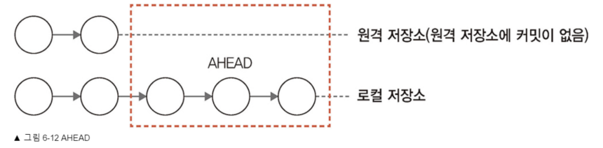
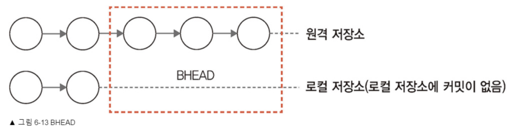

## 6.7 HEAD 포인터

- HEAD 포인터는 브랜치갯수마다 있다 </br>
 브랜치마다 가장 최신의 커밋ID를 가리킨다

- HEAD 기준으로 배열처럼 최신커밋을 가리킬 수 있다. </br>
  ex) 이전 3개 위치 HEAD^^^ 또는 HEAD^3, HEAD~3

AHEAD


BHEAD


## 6.8 생성과 이동
- 브랜치 생성과 이동을 두번씩 입력하기 불편 </br>
  checkout 시 -b 옵션 쓰면 한번에 생성과 이동 </br>

  ```sh
  git checkout -b 브랜치이름
  ```

- 해시키 써서도 브랜치이동 가능 </br>
  ```sh
  git checkout 커밋해시키
  (해시키 앞 7자리만 써도 됨)
  ```
- HEAD 응용해서 브랜치이동하기
  ```sh
  git checkout HEAD~1
  ```
  가장최근커밋에서 하나 더 이전커밋으로 </br> 
  브랜치하나가 HEAD 라는 이름으로 생성 </br>
  그후 거기로 이동됨

  ```sh
  git checkout -
  ```
  이전 브랜치로 복귀 </br></br>


## 6.9 원격 브랜치
```sh
git remote add origin https://github.com/leaping96/react_git_study.git(클론주소)
git remote -v

# 원격 브랜치 정보 열람
ls .git/refs/

git push 원격저장소별칭 브랜치이름

마스터브랜치 전송
git push -u origin master

hotfix 브랜치 전송
git push -u origin hotfix
```

- 새로운브랜치 생성해서 전송하면, </br>
  원격 레포지토리에도 브랜치가 추가된다!

- 원격레포지토리 브랜치와 내 로컬브랜치가 이름은 같지만,
  다른 브랜치인경우, 원격 레포지토리의 다른 브렌치와 수동으로 연결가능
  ```sh
  git push origin 브랜치이름:새로운브랜치

  git push -u origin feature:function
  # 이렇게 하면 내 로컬의 feature 브랜치가 
  # function 이름으로 원격에 추가된다

  # clone 명령어는 마스터브랜치 하나만 가져온다
  # 하지만 다른 브랜치 목록은 깃 명령어로 확인가능
  
  git branch -v  # 이러면 마스터 하나만 나옴

  # 원격 레포지토리의 브랜치 목록을 확인
  git branch -r  # 이러면 마스터외에도 다나옴

  git branch -a # 이러면 모든 브랜치정보 확인

  git branch -vv # 복제한 저장소의 트래킹브랜치목록 확인

  git checkout --track origin/브랜치이름
  git checkout --track origin/function

  # 이러면 마스터가아니라 function 브랜치가 생성되고
  # 트래킹브랜치로 잡힌다

  # 여기서 파일수정후 git push 하면
  # master 브랜치가 아니라 원격의 function 브랜치에 동기화!!

  # 앞에서 원격의 function과 로컬의 feature이 매칭되었으므로
  git checkout feature
  git pull
  # 이럴경우 원격의 function 브랜치가 
  # feature 브랜치로 내려받아짐

  git checkout -b 새이름 origin/브랜치이름
  # 이러면 원격의 브랜치를 내 로컬에 새로운 이름으로 생성

  git branch -u origin/브랜치이름
  # 로컬의 브랜치를 원격 레포지토리의 트래킹브랜치로 업스트림?
  ```
# 아니 업스트림이랑 트래킹브랜치랑 차이가 뭐야..
> 생성할때 바로 트래킹안시키고 그냥 있는 브랜치를 트래킹브랜치로
> 승격시키는게 업스트림인듯
https://yunwuxin1.gitbooks.io/git/content/ko/c9691103839997433fb106c01e5001fe/d9f7abec0110a03fa9570cb33649a2c9.html

## 6.10 브랜치 전송
```sh
git push
git push --setupsteam origin master

# 브랜치병합
git merge 원격저장소별칭/브랜치이름
```


## 6.11 브랜치 삭제

```sh
# 일반적인 삭제
git branch -d 브랜치이름

# 커밋이 있어도 강제삭제
git branch -D 브랜치이름

# 리모트브랜치를 삭제
git push origin --delete 리모트브랜치이름
```
