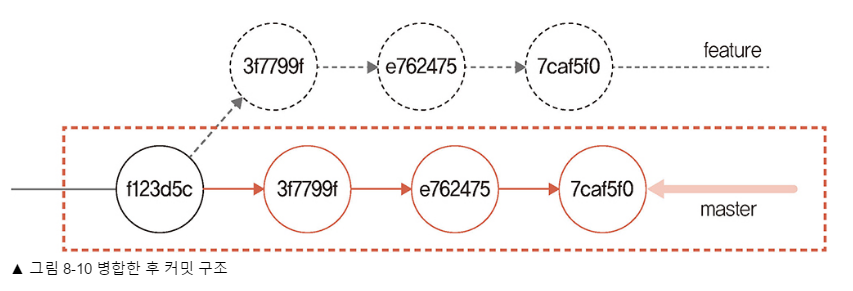
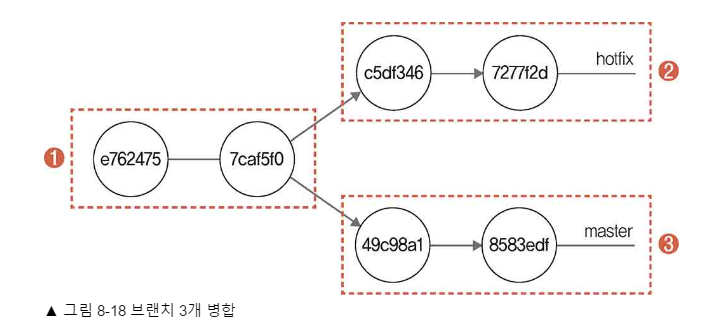
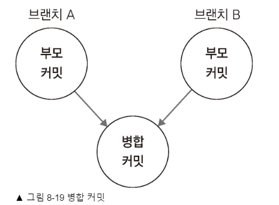
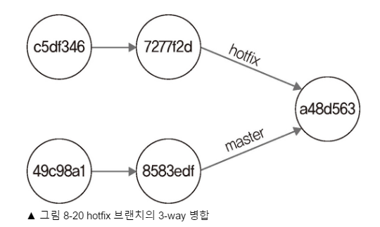

# 8.1 병합

> 병합대싱인 브랜치가 모두 단일 저장소에 있어야 병합가능!

# 8.2 Fast-Forward 병합

```sh
# 1. 브랜치 생성
git checkout -b feature 

# 2. 코드 수정
# ...

# 3. 커밋
git commoit -am "work in feature 1"

# (2,3 을 반복해도됨)

# 4. master 브랜치로 복귀
git checkout master

# 5. Fast-Forward 병합
git merge feature
```

> 둘중에 더 많이 진행된 브랜치를 가져와서 복붙(?) 하는거라 보면됨

# 8.3 3-way 병합

```sh
# 1. 새로운 브랜치 생성
git checkout -b hotfix

# 2. 코드수정
# ...

# 3. 커밋
git commoit -am "work in hotfix 1"

# (2,3 을 반복해도됨)

# 4. master 브랜치로 복귀
git checkout master

# 5. master 에서도 코드수정(hotfix 작업부분이랑 안겹치게)
# ...

# 6. 커밋
git commoit -am "work in master 1"
# (5,6 을 반복해도됨)

# 7. 3-way 병합
git merge hotfix
```





> 공통분모를 찾아서 시작점으로 잡고, </br>
> 차이나는 커밋은 충돌 안나는 선에서 알아서 합쳐주는 방식을 말한다!
